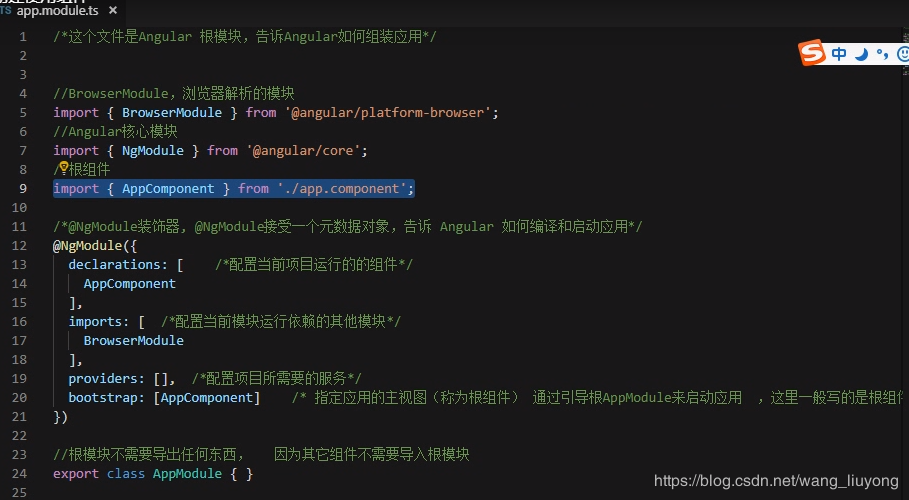

# angular 各功能应用demo
## 启动项目

进入各demo项目下执行：
```
    cnpm i
    ng serve --open
```  
    
## 常用指令
```
  *ngfor
  *ngIf
  插值表达式 {{}}
  属性绑定 []
  事件绑定 ()
  //数据双向绑定
  [(ngModel)]="hero.name"

```
## app.module各模块含义



## 组件


## 路由
### 1.路由配置
app.routing注入；
```ts

import { Routes, RouterModule } from '@angular/router'
import { Observable, of, } from 'rxjs';
import { catchError, map, tap ,switchMap,distinctUntilChanged,debounceTime,combineLatest} from 'rxjs/operators';

```

### 2.路径配置

```ts
  const routes: Routes = [
    { path: '**', redirectTo: '/dashboard', pathMatch: 'full' },
    { path: 'heroes', component: HeroesComponent },
    { path: 'dashboard', component: DashboardComponent },
    { path: 'detail/:id', component: HeroDetailComponent 
      children:[{  //二级路由配置
        path:'/stores',
        component:StoreDetailComponent
      }]
    },
  ];

```

### 3.路由参数的获取以及页面跳转

获取参数的页面引入并且注入：
```ts
  import { ActivatedRoute ,Router} from '@angular/router'
  import { Location } from '@angular/common';

  constructor(
    private route: ActivatedRoute,
    private router: Router,
    private heroService: HeroService,
    private location: Location
  ) {}

  this.location.back();//返回上一页
  this.router.navigateByUrl(path:string) //js实现跳转到指定路径

```
之后再this.route里面即可获取需要的路由信息

```ts
  let obsCombined = Observable.combineLatest(this.route.params, this.route.queryParams, (params, qparams) => ({
            params,
            qparams
        }));


  obsCombined.subscribe(ap => {
      console.log(ap);
      let params = ap['params'];
      let qparams = ap['qparams'];
      alert(qparams['title']);
      alert(params['id']);
  });
```

获取id举例：


```ts
  this.route.paramMap.subscribe(params => {
    let id = params.get('productId');
  }

```

### 禁止浏览器history
```html
 <a routerLink='/sharing'  skipLocationChange="false">
```


## 表单
app.module引入
`import { FormsModule }    from '@angular/forms';`
使用表单的组件：
TS:

```ts
  import { FormBuilder } from '@angular/forms'; 
  export class CartComponent implements OnInit {

    checkoutForm:any;
    
    constructor(
      private formBuilder: FormBuilder
    ) { 

      this.checkoutForm = this.formBuilder.group({
        name: '',
        address: ''
      });
    }

    onSubmit(formData:object){
      //获取到要提交的表单的数据
      console.log('form data: ',formData);
      //购物车数据提交后需要清空
      this.cart=this.cartService.clearCart();
      //表单重置
      this.checkoutForm.reset()
    }
  }
  ```

HTML:
```html

  <form class="form" [formGroup]="checkoutForm" (ngSubmit)="onSubmit(checkoutForm.value)">
    <div class="form_cow">
      <label>Name</label>
      <input type="text" formControlName="name">
    </div>
    
    <div class="form_cow"> 
      <label>Address</label>
      <input type="text" formControlName="address">
    </div>
    
    <button class="button" nz-button nzType="primary" type="submit">submit</button>
  </form>    

```

### 防抖

```ts
  import { Observable, of, } from 'rxjs';
  import { catchError, map, tap ,switchMap,distinctUntilChanged,debounceTime,combineLatest} from 'rxjs/operators';

  private searchText$ = new Subject<string>();
  
  search(packageName: string) {
    this.searchText$.next(packageName);
  }
  
  ngOnInit() {
    this.packages$ = this.searchText$.pipe(
      debounceTime(500),
      distinctUntilChanged(),
      switchMap(packageName =>
        this.searchService.search(packageName))
    );
  }
  
  constructor(private searchService: PackageSearchService) { }

```


## http

app.module；
```ts
  import {HttpClientModule,HttpClientJsonpModule  } from "@angular/common/http";

```

使用的模块引入，一般为某个service:

```ts
  import { HttpClient, HttpParams,HttpHeaders } from '@angular/common/http';
  import { Observable, of } from 'rxjs';
  import { catchError, map, tap ,filter} from 'rxjs/operators';


  constructor(
    private http:HttpClient
  ) { }

  //get获取数据
  public get(path:string,params:any){

    let url=environment.baseUrl+path;

    let dataParams = new HttpParams();
    for (const key in params) {
      if (params[key] === false || params[key]) {
        dataParams = dataParams.set(key, params[key]);
      }
    }

    // 底层http调用
    return this.http.get(url, { params: dataParams })
    // 响应转化为Promise
    // .toPromise();
  }
  //post发送请求

  public post(path:string,option:any){
    const httpOptions = {
      headers: new HttpHeaders({
        'Content-Type':  'application/json',
        'Authorization': 'my-auth-token'
      })
    }

    return this.http.post<Hero>(path, data, httpOptions)
  }

  //请求头是不能修改的，只能重置
  httpOptions.headers = httpOptions.headers.set('Authorization', 'my-new-auth-token');

```
返回的数据都是一个Observable对象，使用subscribe()来获取
调用该服务;
```ts

  //请求json数据时
  this.service.post(path,parma).subscribe(
    (data: Config) => this.config = { ...data }, // success path
    error => this.error = error // error path
  )
  //请求非json数据时
  this.service.post(path,parma).pipe(
    tap(
        data => this.log(filename, data),
        error => this.logError(filename, error)
    );
  ).subscribe()

```


## RXJS

ReactiveX来自微软，它是一种针对异步数据流的编程

```ts
const ob = Observable.fromPromise(somePromise); // Promise转为Observable
const promise = someObservable.toPromise(); // Observable转为Promise
```

优点：
- 一次可发送多个请求
- 可以取消订阅

### Observable 用法
```ts
 import {Observable} from 'rxjs' 

  function xxx(){
    return new Observable((observable)=>{
      this.httpService.get('/blog',{},false).then(((res:Respones)=>{
        if(res.code===200){
          observable.next(res)
          
        }else if(res.status==='ok'){
          observable.next(res)
        }else{
          observable.error(res)
        }
      }))
    })
  }

  //调用
  xxx().pipe(
    filter((res)=>{
      return res.code>0
    }
  )
      //map
      xxx().pipe(
        map((res)=>{
          return res.data
      }
  )

  ).subscribe((res)=>{
    console.log(res);
    //这里被订阅了才会执行
  })


```

### 使用 RXJS防抖
```js
var text = document.querySelector('#text');
var inputStream = Rx.Observable.fromEvent(text, 'keyup') //为dom元素绑定'keyup'事件
                    .debounceTime(250) // 防抖动
                    .pluck('target', 'value') // 取值
                    .switchMap(url => Http.get(url)) // 将当前输入流替换为http请求
                    .subscribe(data => render(data)); // 接收数据

```


# 总结以及要注意地方

### 父子组件的传值
父组件
```ts

    import { Component, OnInit ,ViewChild} from '@angular/core';
    @ViewChild('demo') son:any;
    
    console.log("son:",this.son.str);

```
子组件
```ts
    import { Component, OnInit ,ViewChild,Input,Output,EventEmitter} from '@angular/core';
    
    
    
      public str:string="song daat00000"
    
      @Input () parentData:any;
      @Input() fromFun:any;
      @Output() testSon=new EventEmitter();
    
    
    
    
        console.log(this.parentData);
    
    
      ngAfterViewInit() {
        //在这个钩子中来操作DOM
        console.log('demo view load');
        
        let demo:any=document.getElementById('demo')
        //console.log(demo);
        console.log(this.myDemo.nativeElement.innerHTML);
      }
    
      //方法
      test(){
        this.testSon.emit('son emit')
      }
```


### 渲染
获取数据之前页面会渲染一次，直接渲染未定义的数据会报错，所以渲染数据之前要用*ngIf先进行判断；


